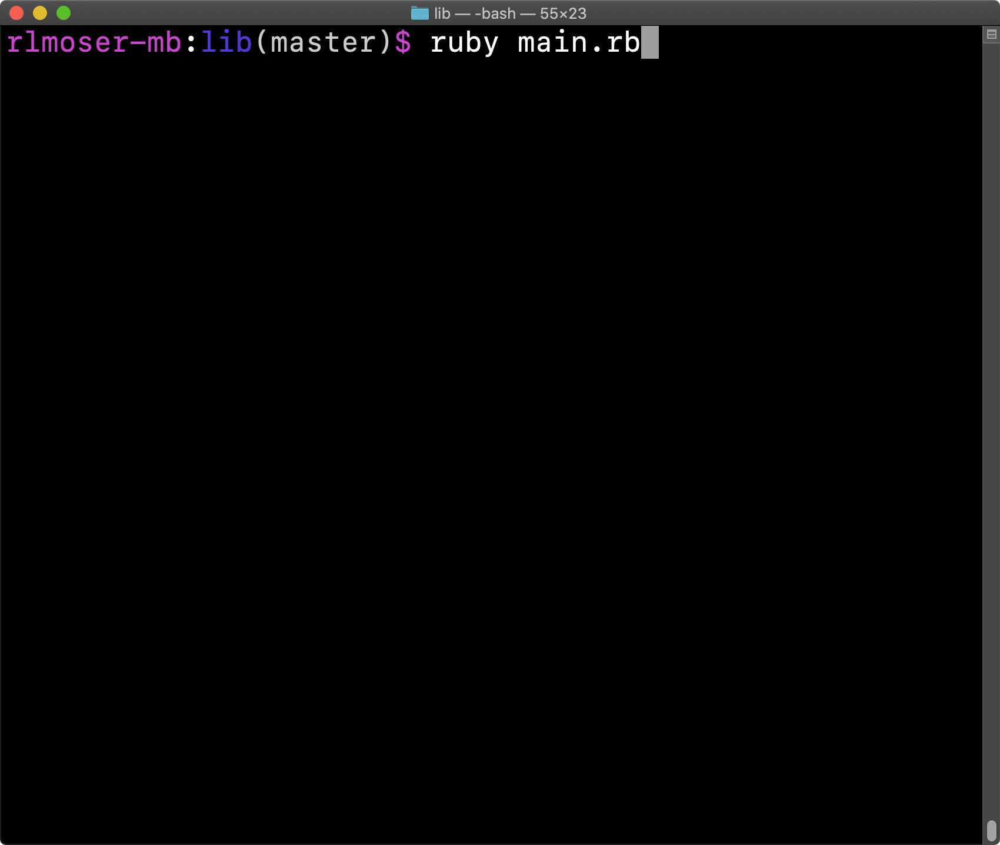

# CLI Ruby Chess Game

This is the final project in the Ruby curriculum at [The Odin Project](https://www.theodinproject.com/courses/ruby-programming/lessons/ruby-final-project?ref=lnav).

## Demo

## Use of Design Patterns
Right after I started working on this project, I joined a book club reading through *Design Patterns in Ruby*, by Russ Olsen. When we are done reading, I hope to come back to this project to review and refactor. Currently, I have implemented two design patterns that we've studied.

**Strategy:** 
I implemented this pattern using the `Board` class as the context and the four `Movement` classes as the different strategies. The `Board` changes its strategy movement to update the position of the piece(s) based on if the move is a basic move, en passant move, castling move, or pawn promotion move. 

**Observer:** 
I implemented this pattern using the `Board` class as the subject and the `Piece` classes as the observers. When each instance of `Piece` is created it becomes an observer of the instance of `Board` that created it. Every time a `Piece` moves in the `Board`, all of the pieces update their legal moves and captures. In addition, when a `Piece` is removed from the `Board`, that observer must also be removed.

## Project Requirements
**2-Player Game with Legal Moves:** 
I choose to split each player turn into two parts, so that I could display the legal moves and captures on the board. I am not an experienced chess player, so creating this visual indicator was important to me. 

**Save and Load Games:** 
Players can save (or quit) a game at the beginning of every turn. A new game can only be loaded at the start of the application. 

**Write Tests:** 
I used a mixture of TDD and writing tests as I wrote each method. I used TDD when I needed it to guide the results, for example the different piece's moves and captures. I wrote unit tests for incoming command methods, incoming query methods, and outgoing command methods.

**Add Simple Computer Player:** 
Since the white player always goes first and has a slightly higher advantage, I decided to have the computer player always be the black player to keep game set-up simple. The computer player chooses a piece with legal moves and/or captures.