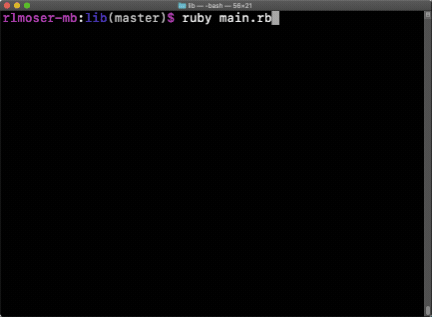

# CLI Ruby Chess Game

This is the final project in the Ruby curriculum at [The Odin Project](https://www.theodinproject.com/courses/ruby-programming/lessons/ruby-final-project?ref=lnav).

## Demo

## Use of Design Patterns
Right after I started working on this project, I joined a book club reading through *Design Patterns in Ruby*, by Russ Olsen. When we are done reading, I hope to come back to this project to review and refactor. Currently, I have implemented two design patterns that we've studied.

**Strategy:** 
I implemented this pattern using the `Board` class as the context and the four `Movement` classes as the different strategies. The `Board` changes its strategy movement to update the position of the piece(s) based on if the move is a basic move, en passant move, castling move, or pawn promotion move. 

**Observer:** 
I implemented this pattern using the `Board` class as the subject and the `Piece` classes as the observers. When each instance of `Piece` is created it becomes an observer of the instance of `Board` that created it. Every time a `Piece` moves in the `Board`, all of the pieces update their legal moves and captures. In addition, when a `Piece` is removed from the `Board`, that observer must also be removed.

## Features
- Displaying Legal Moves
- Random Computer Player
- Save/Load

## Testing
I used a mixture of TDD and writing tests after each method. 

I used TDD to guide the results for each piece moves and captures. Most of the time, I wrote tests as I wrote each method and wrote tests for the edge cases. 
